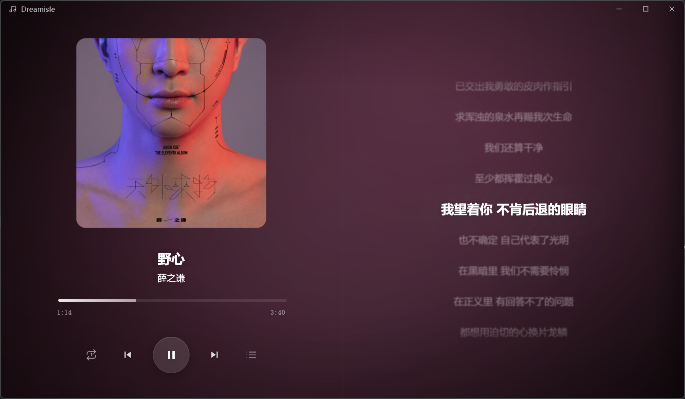

# 🎵 Dreamisle

> 一个基于 Electron 构建的极简、沉浸式本地音乐播放器。
> 摒弃繁杂的界面，专注于音乐与视觉的流动。



## ✨ 特性 (Features)

Dreamisle 旨在提供最纯粹的听觉与视觉体验，特色功能包括：

*   **🎨 沉浸式环境光**：背景随当前播放的音乐封面色调实时流转，营造独特的听歌氛围。
*   **💡 动态封面辉光**：专辑封面拥有根据主色调生成的呼吸感辉光阴影，拒绝死板的黑色投影。
*   **🌫️ 现代毛玻璃 UI**：高级磨砂玻璃质感播放列表，视觉轻盈。
*   **🎛️ 隐形手势控制**：鼠标悬停在封面区域时，**滚动滚轮**即可调节音量，配合极简 HUD 显示。
*   **🌊 液态交互体验**：切歌时文字信息的丝滑下沉/上浮过渡动画，拒绝生硬跳变。
*   **📂 强大的本地解析**：
    *   递归扫描文件夹导入音乐。
    *   支持 MP3, FLAC, WAV, OGG, M4A 格式。
    *   基于 `music-metadata` 读取内嵌封面与元数据。
*   **🎼 歌词与翻译**：
    *   优先读取同目录同名 `.lrc` 文件，其次读取内嵌歌词。
    *   通用歌词解析：支持同时间戳双行、括号、竖线、Tab、薄空格等多种双语格式自动拆分。
    *   翻译开关：歌词区右下角「译」按钮一键显示/隐藏翻译，状态记忆。
    *   长歌词单行滚动：当前播放行超宽时行内水平往返滚动，完整展示。
    *   点击歌词行跳转播放位置；歌词时间偏移（`[offset:]`）自动校正。
*   **🌙 桌面歌词**：置顶悬浮窗实时显示当前歌词，支持背景/字体不透明度、字体颜色、自定义字体。
*   **📊 播放统计**：长按 Left Shift 呼出统计面板——当前歌曲音质规格（Hi-Res / SQ / HQ 分级）、完整播放/单曲循环计数、总播放次数、日均播放与全曲播放次数排行（点击即可播放）。
*   **📃 自定义歌单**：右键歌曲添加到歌单、拖拽排序、重命名/删除，队列与曲库无缝切换。
*   **🔍 搜索与排序**：按歌名/歌手/默认/随机排序，实时搜索过滤。
*   **💾 自动记忆**：记住音乐库路径、播放进度、音量、播放模式与各项设置，下次打开即刻续播。

## ⌨ 快捷键（Shortcut Keys）

| 快捷键 | 功能 |
| ------ | ---- |
| Space | 播放 / 暂停 |
| Q / E | 上一曲 / 下一曲 |
| R | 切换播放模式（列表循环 / 单曲循环 / 随机） |
| 按住 Left ALT 0.5s | 呼出 / 折叠播放列表 |
| 按住 Left CTRL 0.5s | 呼出 / 折叠歌单 |
| 按住 Left SHIFT 0.5s | 呼出 / 折叠播放统计 |
| F5 | 切换小窗模式（置顶迷你窗口） |
| Ctrl + , | 打开设置 |
| Ctrl + Alt + L | 显示 / 隐藏桌面歌词 |
| H | 打开 / 关闭帮助 |
| Esc | 依次关闭菜单 / 浮层 / 抽屉 |
| 封面区域滚动滚轮 | 调节音量 |
| 点击歌词行 | 跳转到对应播放位置 |

## 🛠️ 技术栈 (Tech Stack)

*   **Core**: Electron (ESM 模式)
*   **Frontend**: JS, CSS
*   **Data Persistence**: `electron-store`
*   **Audio Parsing**: `music-metadata`

## 🚀 快速开始 (Getting Started)

### 1. 克隆项目
```bash
git clone https://github.com/Dreameisle-Dev/Dreamisle-electron.git
cd dreamisle
```

or using ssh

```bash
git clone git@github.com:Dreameisle-Dev/Dreamisle-electron.git
```

### 2. 安装依赖
```bash
npm install
```

### 3. 启动应用
```bash
npm start
```

### 4. 打包 Windows 安装包（可选）
```bash
npm run build:win
```

## 🔧 项目结构
```
dreamisle/
└── src/
    ├── main/           # 主进程：入口、窗口、托盘、音乐库、歌单、统计、IPC
    ├── preload/        # 预加载桥接脚本
    ├── lyrics/         # 桌面歌词悬浮窗
    ├── shared/         # 主/渲染进程共享模块（i18n、歌词解析、统计逻辑）
    ├── renderer/       # 渲染进程
    │   ├── index.html
    │   ├── js/         # 按职责拆分：入口/播放/列表/歌单/歌词/统计/设置/主题
    │   └── style/
    └── assets/         # 应用图标
```

代码格式化使用 Prettier（单引号、2 空格缩进、CRLF），执行 `npm run format` 可统一格式。

## 📄 License
MIT
