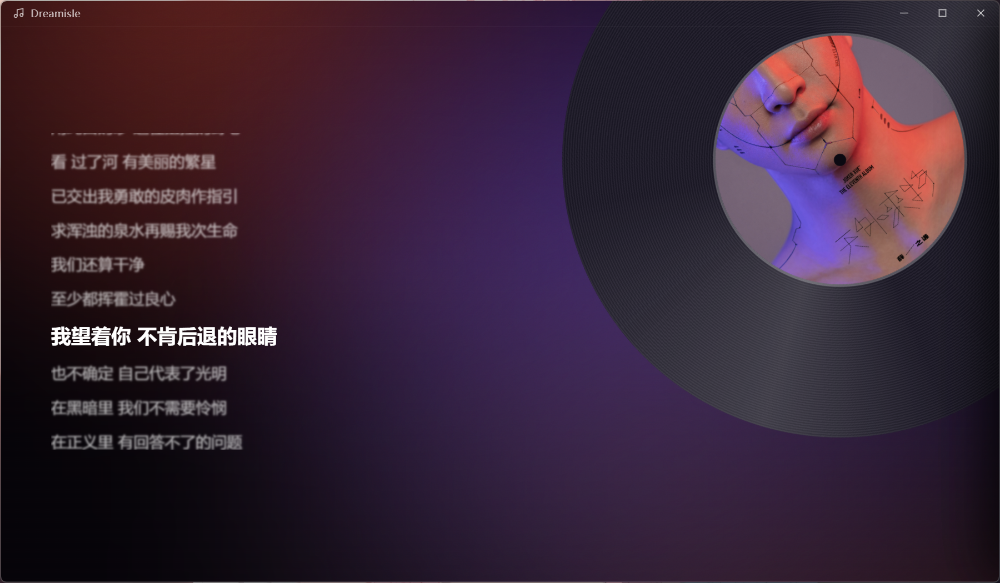

# Dreamisle

> A minimalist, immersive local music player built with Electron.
> Leave the clutter behind and focus on the flow of music and visuals.
  
[中文版](../README.md) | English Version
  


## Features

Dreamisle is designed to deliver the purest listening and visual experience. Highlights include:

*   **Immersive ambient light**: The background flows in real time with the dominant colors of the album cover of the currently playing track, creating a unique listening atmosphere.
*   **Dynamic cover glow**: The album cover has a breathing glow shadow generated from its dominant colors — no more flat black shadows.
*   **Modern frosted-glass UI**: A premium frosted-glass playlist, visually lightweight.
*   **Invisible gesture controls**: Hover over the cover area and **scroll the mouse wheel** to adjust volume, paired with a minimal HUD display.
*   **Auto-hiding control bar**: When the pointer leaves the bottom of the window, the playback bar slides out of view leaving only a slim hint line; move back toward the bottom and it slides in again.
*   **Mini mode**: Press F5 to collapse into a 300×340 always-on-top mini window showing just the cover, the current lyric line, and playback controls — handy in a screen corner.
*   **Liquid interactions**: Silky sink/rise transitions for track info when switching songs — no harsh jumps.
*   **Powerful local parsing**:
    *   Recursively scan folders to import music.
    *   Supports MP3, FLAC, WAV, OGG, M4A formats.
    *   Fast embedded cover and metadata reading (title/artist/album/bitrate/sample rate/bit depth) based on `music-metadata`.
*   **Lyrics & translations**:
    *   Prefers an adjacent `.lrc` file with the same name, falling back to embedded lyrics.
    *   Universal lyric parsing: auto-splits multiple bilingual formats such as same-timestamp line pairs, brackets, vertical bars, tabs, and thin spaces.
    *   Translation toggle: the "译" button in the lower-right corner of the lyrics area shows/hides translations with one click, and remembers your choice.
    *   Single-line scrolling for long lyrics: the currently playing line scrolls horizontally back and forth when it overflows, so the full line stays readable.
    *   Click a lyric line to jump to that playback position; lyric time offsets (`[offset:]`) are corrected automatically.
*   **Desktop lyrics**: An always-on-top floating window shows the current lyrics in real time, with adjustable background/font opacity, font color, and custom fonts.
*   **Playback statistics**: Hold Left Shift to open the statistics panel — audio quality specs for the current track (Hi-Res / SQ / HQ tiers), full-play and single-loop counts, total plays, daily average, and an all-song play count ranking (click to play).
*   **10-band equalizer**: Settings → "Equalizer" adjusts ten bands from 31Hz to 16kHz (±12dB), with nine built-in presets (Acoustic, Pop, Rock, Jazz, Classical, Electronic, Bass boost, Vocal, Late night). Dragging any fader switches to a custom curve. An auto preamp offsets the largest boost to avoid clipping. With the switch off, audio stays on the original untouched path.
*   **Custom playlists**: Right-click a song to add it to a playlist, drag to reorder, rename/delete, and switch seamlessly between the queue and the library.
*   **Search & sorting**: Sort by title/artist/shuffle, with real-time search filtering. In title and artist modes the list carries an A-Z# index on its right edge (Latin and Chinese merged by pinyin) for quick jumps.
*   **System media controls**: Integrates with Windows SMTC — keyboard media keys and the system volume flyout control playback directly, showing cover art, track info, and progress.
*   **Auto memory**: Remembers your music library paths, playback progress, volume, play mode, and all settings — resume right where you left off next time.

## Shortcut Keys

| Shortcut | Action |
| ------ | ---- |
| Space | Play / Pause |
| Q / E | Previous / Next track |
| R | Switch play mode (list loop / single loop / shuffle) |
| Hold Left ALT 0.5s | Show / hide the playlist |
| Hold Left CTRL 0.5s | Show / hide playlists |
| Hold Left SHIFT 0.5s | Show / hide playback statistics |
| F5 | Toggle mini mode (always-on-top mini window) |
| Ctrl + , | Open settings |
| Ctrl + Alt + L | Show / hide desktop lyrics |
| H | Open / close help |
| Esc | Close menu / overlay / drawer in order |
| Scroll the mouse wheel over the cover area | Adjust volume |
| Click a lyric line | Jump to the corresponding playback position |

## Tech Stack

*   **Core**: Electron (ESM mode)
*   **Frontend**: JS, CSS
*   **Data Persistence**: `electron-store`
*   **Audio Parsing**: `music-metadata`
*   **Audio Processing**: Web Audio API (equalizer: 10 cascaded peaking BiquadFilter nodes plus an auto-preamp GainNode; the audio chain is left untouched while the EQ is off)

## Getting Started

### 1. Clone the repository
```bash
git clone https://github.com/Dreameisle-Dev/Dreamisle-electron.git
cd Dreamisle-electron
```

or using ssh

```bash
git clone git@github.com:Dreameisle-Dev/Dreamisle-electron.git
```

### 2. Install dependencies
```bash
npm install
```

### 3. Launch the app
```bash
npm start
```

### 4. Build the Windows installer (optional)
```bash
npm run build:win
```

## Project Structure
```
Dreamisle-electron/
├── README.md                 # Chinese docs (default)
├── README/README.en.md       # English docs (this file)
├── img/                      # Documentation screenshots
└── src/
    ├── main/                 # Main process: entry, window, tray, music library, playlists, persistence, IPC
    ├── preload/              # Preload bridges (one for the main window, one for desktop lyrics)
    ├── lyrics/               # Desktop lyrics floating window
    ├── shared/               # Pure logic shared by main/renderer (no DOM dependency)
    │   ├── i18n.js           #   Chinese/English dictionary
    │   ├── lyrics-parse.js   #   Lyric parsing entry + universal-lyric-parser.js
    │   ├── initial-letter.js #   Initial-letter bucketing and the A-Z# index
    │   ├── equalizer.js      #   Band table / preset curves / auto preamp
    │   ├── stats.js          #   Play counts and ranking
    │   ├── stats-format.js   #   Quality tiers and formatting
    │   └── song-metadata.js  #   Path-based backfill between playlist snapshots and the library cache
    ├── renderer/             # Renderer process
    │   ├── index.html
    │   ├── js/               # Split by responsibility: entry/playback/queue/playlists/lyrics/statistics/settings/theme/equalizer
    │   └── style/            # tokens.css (design tokens) + index.css
    └── assets/               # App icon
```

Code is formatted with Prettier (single quotes, 2-space indent, CRLF). Run `npm run format` to apply it consistently.

## License
MIT
